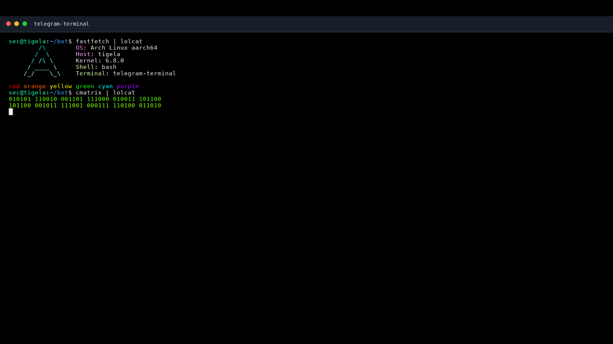

# telegram-terminal

A lightweight Telegram-based remote shell for Linux. It provides a persistent `bash` session through Telegram, with live command output, interactive terminal controls, file transfer, and a simple line-based text editor.

## Features

- Persistent shell session using `pexpect`
- Run Linux commands directly from Telegram
- Live output updates in the same Telegram message
- Large command outputs are sent automatically as `.txt` files
- Interactive controls such as Ctrl+C, Ctrl+D, Ctrl+Z, Enter, Tab, arrows, Esc, Backspace and Delete
- Upload files from Telegram to the server
- Download files from the server to Telegram
- Built-in Telegram-friendly text editor
- Editor undo, find and replace commands
- Shell status, reset and restart commands
- Command history with rerun support
- Optional output logging to `logs/`
- Xterm-style terminal screenshots with VT100/ANSI screen emulation
- Bundled monospace font for consistent screenshot rendering
- Run commands directly as terminal screenshots
- Screenshot command runner with optional buffer control
- Topic-safe screenshot replies in forum groups
- Topic-safe large output file replies in forum groups
- Screenshot wide mode and command runner
- Better screenshots for fullscreen terminal apps such as `htop`, `btop`, `nano` and `vim`
- Screenshots include the executed command prompt with user, host and directory
- Session output buffer clearing without interrupting active commands
- Output rendering state reset between commands
- Session output buffer status
- Shell watchdog that restarts a dead or stalled bash session
- Reset screenshot settings
- Save session output buffer on the server
- Bot uptime and about commands

## Commands

All commands start with `$`. Built-in bot commands use namespaced prefixes like `tt`, `buf`, `cmd`, `out` and `shot`, so normal shell commands such as `$tail file.txt`, `$history`, `$nano`, `$log`, `$get` and `$ss` can still run in the terminal.

### Shell

- `$<command>`
- `$ttinput your text here`
- `$ttpaste raw text without pressing enter`

### Terminal Keys

- `$ctrlc`
- `$ctrl c`
- `$ctrld`
- `$ctrlz`
- `$enter`
- `$tab`
- `$up`
- `$down`
- `$left`
- `$right`
- `$key esc`
- `$key backspace`
- `$key delete`
- `$key home`
- `$key end`
- `$key pgup`
- `$key pgdn`

### Screenshots

- `$shot`
- `$shot 80`
- `$shot wide`
- `$shot wide 80`
- `$shot clear`
- `$shot run neofetch`
- `$shot run wide btop`
- `$shot run clear neofetch`
- `$shot run --no-session neofetch`
- `$shot run ls -la`

`$shot` renders the current xterm-compatible virtual screen with scrollback, including ANSI colors, cursor movement, clears and fullscreen terminal layouts. `$shot run` appends to the existing virtual screen like a normal terminal; use `$buf clear` or `$shot clear` when you want a clean screen.

### Buffers

- `$buf tail`
- `$buf tail 200`
- `$buf tail full`
- `$buf send`
- `$buf send output.txt`
- `$buf save output.txt`
- `$buf clear`
- `$buf status`

Large command outputs are sent automatically as full `.txt` files when a command finishes, and file replies stay in the original topic in forum groups.

### Files

- `$ttget /path/to/file.txt`
- `$ttput /path/to/save/file.txt`

Send a Telegram document with caption `$ttput /path/to/save/file.txt` to upload it.

### Editor

- `$ttedit open file.txt`
- `$ttedit show`
- `$ttedit set 3 new content for line 3`
- `$ttedit insert 3 inserted before line 3`
- `$ttedit append new line at the end`
- `$ttedit delete 5`
- `$ttedit delete 5-10`
- `$ttedit undo`
- `$ttedit find token`
- `$ttedit replace old new`
- `$ttedit replace-all old new`
- `$ttedit save`
- `$ttedit cancel`

### History And Logs

- `$cmd history`
- `$cmd history 50`
- `$cmd last`
- `$cmd rerun 3`
- `$out log on`
- `$out log off`
- `$out log status`

### Bot

- `$tt help`
- `$tt status`
- `$tt restart`
- `$tt reset`
- `$tt version`
- `$tt ping`
- `$tt uptime`
- `$tt about`

## Installation

Clone the repository:

- `git clone https://github.com/farmei/telegram-terminal.git`
- `cd telegram-terminal`

Create and activate a virtual environment:

- `python3 -m venv remoteenv`
- `source remoteenv/bin/activate`

Install dependencies:

- `pip install -r requirements.txt`

## Telegram API Setup

Get your Telegram API credentials from `https://my.telegram.org/apps`.

Steps:

- Open `https://my.telegram.org/apps`
- Log in with your Telegram phone number
- Create an application
- Copy the `api_id` and `api_hash`

Set the credentials in `telegram-terminal.py`:

- `api_id = 123456`
- `api_hash = "your_api_hash"`

## Run

Start the bot:

- `source remoteenv/bin/activate`
- `python3 telegram-terminal.py`

On the first run, Telegram will ask for login confirmation and create a local session file. After login, send commands from your own Telegram account using the `$` prefix.

Example:

- `$tt ping`
- `$tt uptime`
- `$tt about`
- `$pwd`
- `$shot run neofetch`

## Version

Current version: `1.2.0`

## License

MIT
